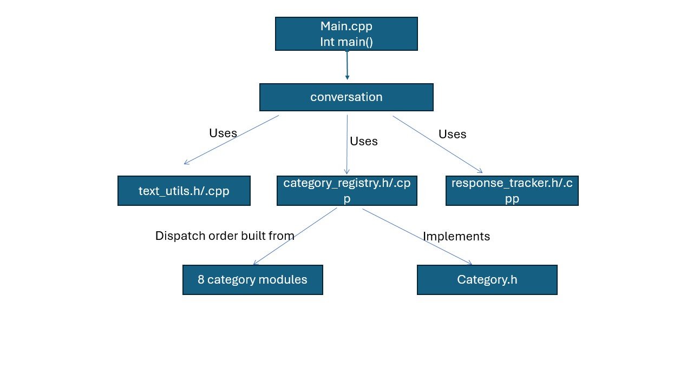

# myELIZA — System Overview

myELIZA is a command-line recreation of ELIZA built for CSCE 2110 Project 2. It reads a line of input, matches it against a set of topic categories, and prints a response built from the matched regex. Built solo.

`main.cpp` holds only `int main()`, which calls `conversation::run()`. That function reads a line, normalizes it, checks for "bye", checks whether the normalized line was already said this session, then checks each of the eight topic categories in order until one matches.

The categories are concern, relationships, financial, wellbeing, education, entertainment, technology & social media, and generic verbs, checked in that order. Concern goes first so crisis-related keywords aren't caught by a broader category's regex before the safety response can fire. Generic verbs goes last since it's the widest net and only handles what nothing else claimed.

Two shared utilities support every category. `text_utils` normalizes input and reflects pronouns ("I" to "you", "my" to "your") for responses that echo part of what the user said. `response_tracker` records every line and flags repeats, which is what lets the program prompt the user to answer differently when they repeat themselves.

## Data structures

The `Category` struct holds a name and two function pointers, `matches` and `respond`. `category_registry.cpp` builds a `vector<Category>` from all eight categories in priority order — a dynamic array rather than a class hierarchy, since the only operation ever performed on it is walking it front to back until something matches. Adding a ninth category later would be one more struct literal, not a new subclass.

`ResponseTracker` wraps an `unordered_map<string, int>`, a hash table keyed on the normalized input string and storing how many times that line has been said. A hash table fits because the only question ever asked of it is whether an exact string has been seen before, which is an average O(1) lookup. Nothing about the order of past answers is needed, so a list or tree would cost more without buying anything.

Across the eight components the program defines 72 distinct regular expressions, built with `regex_match` for whole-line answers, `regex_search` for phrases appearing anywhere in a sentence, and `regex_replace` for substituting captured text into response templates.

## System diagram

`main.cpp` calls `conversation`, which is the only file that talks to `text_utils`, `response_tracker`, and `category_registry` directly. `category_registry` builds the priority-ordered list of the eight categories, each of which implements the `Category` interface.

## Components

- [Generic Verbs](generic-verbs)
- [Concern](concern)
- [Relationships](relationships)
- [Financial](financial)
- [Wellbeing](wellbeing)
- [Education](education)
- [Entertainment](entertainment)
- [Technology & Social Media](technology)
